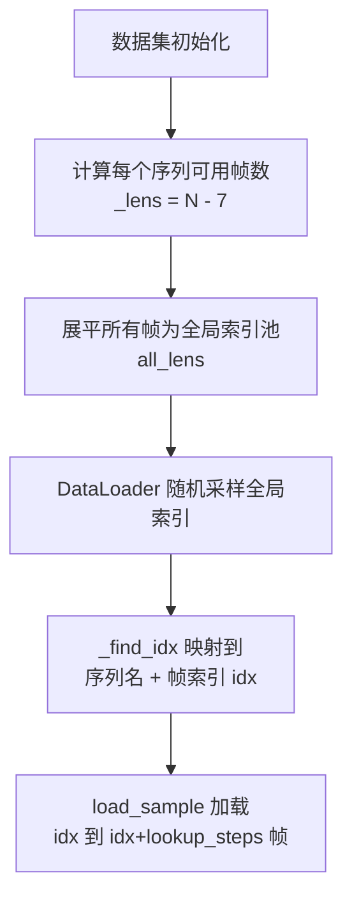
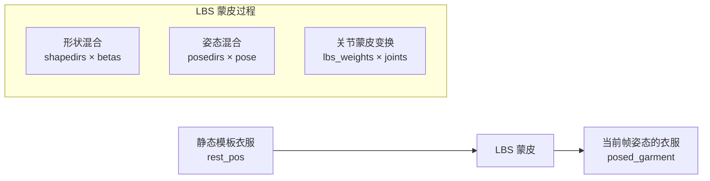
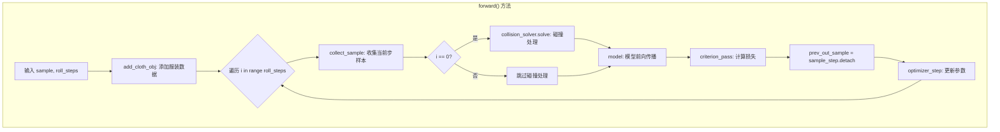
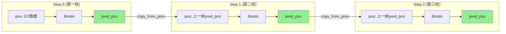
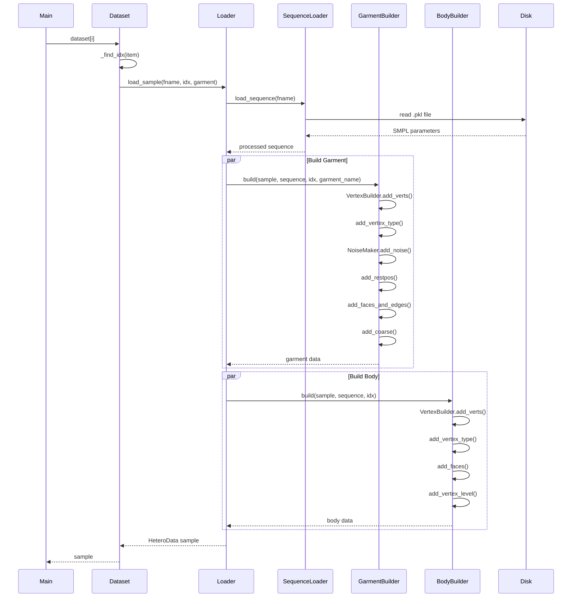
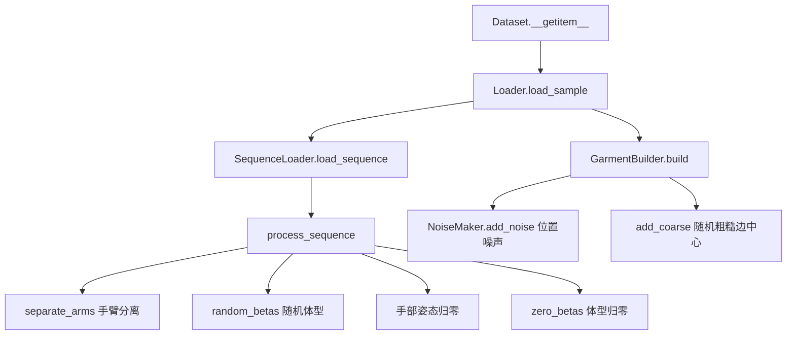
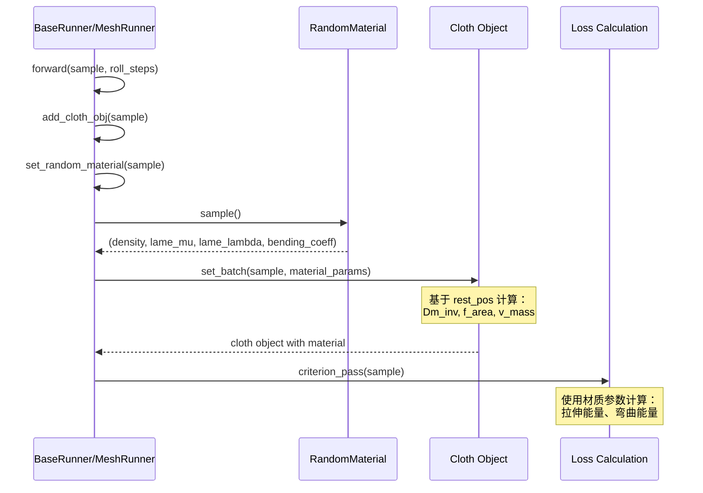
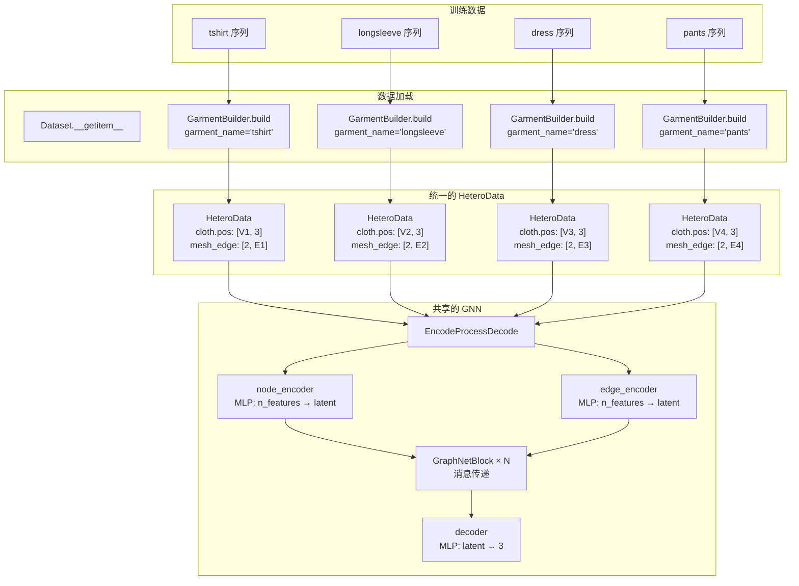

# HOOD 数据处理指南

本文档全面概述了 HOOD 项目中的数据处理流程，包括数据集结构、数据格式以及从原始数据到模型输入的完整工作流程。

## 目录

1. [数据集架构概览](#1-数据集架构概览)
2. [数据输入格式](#2-数据输入格式)
3. [HeteroData 数据结构](#3-heterodata-数据结构)
4. [数据处理流程](#4-数据处理流程)
5. [代码结构](#5-代码结构)
6. [训练数据使用](#6-训练数据使用)
7. [完整数据加载流程](#7-完整数据加载流程)
8. [数据预处理](#8-数据预处理)
9. [数据缓存与存储机制](#9-数据缓存与存储机制)
10. [Mesh格式数据支持](#10-mesh格式数据支持)

---

## 1. 数据集架构概览

数据加载系统采用分层设计，包含以下组件：

```
create() ──► Loader ──► Dataset
               │
               ├── SequenceLoader (loads SMPL parameter sequences)
               ├── GarmentBuilder (builds garment mesh)
               └── BodyBuilder    (builds body mesh)
```

### 核心类

1. **Dataset 类** (datasets/postcvpr.py 第 748-805 行)
   - **训练模式** (wholeseq=False)：按帧索引加载数据，每个样本是单帧
   - **验证模式** (wholeseq=True)：加载整个序列

2. **关键组件**
   - `Config`：存储所有配置参数
   - `SequenceLoader`：从磁盘加载并预处理 SMPL 序列
   - `GarmentBuilder`：构建服装网格数据
   - `BodyBuilder`：构建身体（障碍物）网格数据
   - `VertexBuilder`：从 SMPL 参数构建顶点序列
   - `NoiseMaker`：添加高斯噪声用于数据增强

---

## 2. 数据输入格式

### SMPL 序列文件 (.pkl)

```python
{
    'body_pose': np.array,      # [Nx69] SMPL 姿态参数
    'global_orient': np.array,  # [Nx3] 全局朝向
    'transl': np.array,         # [Nx3] 全局位移
    'betas': np.array           # [10] 体型参数
}
```

### 服装字典 (garments_dict.pkl)

```python
{
    'garment_name': {
        'rest_pos': np.array,    # [Vx3] 标准姿态下顶点位置
        'faces': np.array,       # [Fx3] 面片索引
        'node_type': np.array,   # [Vx1] 顶点类型 (0=普通, 3=固定)
        'lbs': dict,             # 线性蒙皮权重和混合形状
        'center': list,          # 粗糙边的中心节点
        'coarse_edges': dict     # 预计算的粗糙边
    }
}
```

### 数据分割文件 (datasplit.csv)

```csv
id,length,garment
sequence_001,300,tshirt
sequence_002,250,dress
```

---

## 3. HeteroData 数据结构

HeteroData 是 PyTorch Geometric 库中的核心数据结构，用于在 HOOD 项目中表示异构图。它以统一的格式存储所有服装和身体网格数据。

### 什么是异构图？

异构图是指包含多种类型节点和多种类型边的图：

**在 HOOD 中：**
- **节点类型**：`cloth`（服装）、`obstacle`（身体）
- **边类型**：`mesh_edge`（网格边）、`coarse_edge0/1...`（粗糙边）

### 基本用法

```python
from torch_geometric.data import HeteroData

sample = HeteroData()

# 添加节点属性（两种等价方式）
sample['cloth'].pos = torch.tensor(...)
sample['cloth']['pos'] = torch.tensor(...)

# 添加边数据 (源类型, 边类型, 目标类型)
sample['cloth', 'mesh_edge', 'cloth'].edge_index = edges  # [2, E]

# 存储标量属性
sample['sequence_name'] = 'motion_001'
sample['garment_name'] = 'tshirt'
```

### HOOD 中的 HeteroData 结构

```
HeteroData(
    # ========== 服装节点 ==========
    cloth={
        pos:          [V, 3] or [V, N, 3],   # 当前帧顶点位置
        prev_pos:     [V, 3] or [V, N, 3],   # 前一帧顶点位置
        target_pos:   [V, 3] or [V, N, 3],   # 下一帧位置 (Ground Truth)
        lookup:       [V, L, 3],              # 未来 L 帧位置 (仅训练)
        rest_pos:     [V, 3],                 # 标准姿态位置
        vertex_type:  [V, 1],                 # 0=普通, 3=固定
        vertex_level: [V, 1],                 # 粗糙层级
        faces_batch:  [3, F],                 # 面片索引
    },
    
    # ========== 障碍物（身体）节点 ==========
    obstacle={
        pos:          [V_body, 3] or [V_body, N, 3],
        prev_pos:     ...,
        target_pos:   ...,
        lookup:       ...,
        vertex_type:  [V_body, 1],   # 1=普通障碍物, 2=手部 (推理时忽略)
        vertex_level: [V_body, 1],   # 始终为 0
        faces_batch:  [3, F_body],
    },
    
    # ========== 边 ==========
    (cloth, mesh_edge, cloth)]={
        edge_index: [2, E]           # 网格边
    },
    (cloth, coarse_edge0, cloth)]={
        edge_index: [2, E0]          # 第 0 层粗糙边
    },
    (cloth, coarse_edge1, cloth)]={
        edge_index: [2, E1]          # 第 1 层粗糙边 (如果有)
    },
    
    # ========== 元数据 ==========
    sequence_name='motion_001',
    garment_name='tshirt'
)
```

### HeteroData 的优势
| 特性 | 描述 |
|---------|-------------|
| 类型安全 | 不同类型的节点/边数据相互隔离 |
| 灵活扩展 | 易于添加新的节点/边类型 |
| 自动批处理 | 自动合并多个样本 |
| GPU 友好 | 所有张量可以一起移动到 GPU |
| 消息传递 | 直接支持 PyG MessagePassing 层 |

---

## 4. 数据处理流程

### 4.1 序列预处理 (SequenceLoader.process_sequence)

### 4.2 服装网格构建 (GarmentBuilder.build)

生成的数据结构：

| 属性 | 维度 | 描述 |
|-----------|------------|-------------|
| prev_pos | [Vx3] 或 [VxNx3] | 前一帧顶点位置 |
| pos | [Vx3] 或 [VxNx3] | 当前帧顶点位置 |
| target_pos | [Vx3] 或 [VxNx3] | 下一帧顶点位置 (GT) |
| lookup | [VxLx3] | 未来 L 帧位置 (用于训练) |
| rest_pos | [Vx3] | 标准姿态位置 |
| vertex_type | [Vx1] | 顶点类型 |
| mesh_edge | [2xE] | 网格边 |
| coarse_edge{i} | [2xEi] | 多层级粗糙边 |

### 4.3 身体网格构建 (BodyBuilder.build)

| 属性 | 维度 | 描述 |
|-----------|------------|-------------|
| prev_pos / pos / target_pos | [Vx3] | SMPL 身体顶点 |
| faces_batch | [3xF] | 身体面片 |
| vertex_type | [Vx1] | 1=普通障碍物, 2=手部 (推理时忽略) |

---

## 5. 代码结构

### 类关系概览

```
Config (stores config parameters)
  │
  ├─→ SequenceLoader (loads SMPL sequences)
  │    └─→ Loader
  │         └─→ Dataset
  │
  ├─→ VertexBuilder (builds vertices from SMPL)
  │    ├─→ GarmentBuilder
  │    │    └─→ Loader
  │    │         └─→ Dataset
  │    │
  │    └─→ BodyBuilder
  │         └─→ Loader
  │              └─→ Dataset
  │
  └─→ NoiseMaker (adds noise)
       └─→ GarmentBuilder
            └─→ Loader
                 └─→ Dataset
```

### 类职责

| 类 | 职责 | 依赖 | 被使用于 |
|-------|---------------|--------------|---------|
| Config | 存储所有配置参数 | 无 | 所有其他类 |
| VertexBuilder | 从 SMPL 参数构建顶点序列 | Config | GarmentBuilder, BodyBuilder |
| NoiseMaker | 为训练数据添加高斯噪声 | Config | GarmentBuilder |
| GarmentBuilder | 构建完整的服装 HeteroData | VertexBuilder, NoiseMaker, Config | Loader |
| BodyBuilder | 构建完整的身体 HeteroData | VertexBuilder, Config | Loader |
| SequenceLoader | 从磁盘加载并预处理 SMPL 序列 | Config | Loader |
| Loader | 组合所有 Builder 生成完整样本 | SequenceLoader, GarmentBuilder, BodyBuilder | Dataset |
| Dataset | PyTorch Dataset 接口，管理数据索引 | Loader | 训练/验证代码 |

### 数据流向

```
原始数据 (.pkl 文件)
     │
     ▼
SequenceLoader.load_sequence()
     │
     ├─→ GarmentBuilder.build()
     │    ├─→ VertexBuilder.add_verts()      # 添加 pos, prev_pos, target_pos
     │    ├─→ add_vertex_type()              # 添加顶点类型
     │    ├─→ NoiseMaker.add_noise()         # 添加训练噪声
     │    ├─→ add_restpos()                  # 添加静息位置
     │    ├─→ add_faces_and_edges()          # 添加面片和边
     │    ├─→ add_coarse()                   # 添加粗糙边
     │    └─→ add_button_edges()             # 添加纽扣边 (可选)
     │
     └─→ BodyBuilder.build()
          ├─→ VertexBuilder.add_verts()      # 添加 pos, prev_pos, target_pos
          ├─→ add_vertex_type()              # 添加顶点类型
          ├─→ add_faces()                    # 添加面片
          └─→ add_vertex_level()             # 添加层级标签
     │
     ▼
HeteroData
```

### 类层次结构 (组合关系)

```
Dataset
 └── Loader
      ├── SequenceLoader          # 加载 SMPL 参数
      ├── GarmentBuilder          # 构建服装
      │    ├── VertexBuilder      # 构建顶点
      │    └── NoiseMaker         # 添加噪声
      └── BodyBuilder             # 构建身体
           └── VertexBuilder      # 构建顶点 (共享类，独立实例)
```

### 关键方法调用链

当调用 `dataset[i]` 时：

```
Dataset.__getitem__(item)
    │
    ├── _find_idx(item)                     # 将全局索引转换为 (序列名, 帧索引, 服装名)
    │
    └── Loader.load_sample(fname, idx, garment_name, betas_id)
            │
            ├── SequenceLoader.load_sequence(fname)
            │       ├── 从磁盘读取 .pkl
            │       └── process_sequence()           # 预处理
            │
            ├── GarmentBuilder.build(sample, sequence, idx, garment_name)
            │       ├── VertexBuilder.add_verts()    # 添加 pos, prev_pos, target_pos
            │       ├── add_vertex_type()            # 添加顶点类型
            │       ├── NoiseMaker.add_noise()       # 添加训练噪声
            │       ├── add_restpos()                # 添加静息位置
            │       ├── add_faces_and_edges()        # 添加面片和边
            │       ├── add_coarse()                 # 添加粗糙边
            │       └── add_button_edges()           # 添加纽扣边 (可选)
            │
            └── BodyBuilder.build(sample, sequence, idx)
                    ├── VertexBuilder.add_verts()    # 添加 pos, prev_pos, target_pos
                    ├── add_vertex_type()            # 添加顶点类型
                    ├── add_faces()                  # 添加面片
                    └── add_vertex_level()           # 添加层级标签
```

---

## 6. 训练数据使用

### 数据集结构

从配置文件 `postcvpr.yaml` 可以看到：
```yaml
split_path: 'datasplits/train.csv'
```

训练数据通过一个 CSV 文件 (train.csv) 来定义，这个 CSV 文件包含多个动作序列的信息。

### 训练数据组织

```
├── train.csv (包含多个序列的索引)
│   ├── 序列 1: id, length, garment
│   ├── 序列 2: id, length, garment
│   ├── ...
│   └── 序列 952: id, length, garment
│
训练过程:
├── 将所有序列的帧展平为一个索引池
├── 每个训练步骤随机采样一个帧窗口（来自某个序列）
└── 通过多个 epoch 遍历所有序列的所有帧
```

### 训练帧选择机制

**train.py 会随机选择中间帧开始训练，而不是从第一帧开始。**

#### 帧选择流程



#### 关键代码

**`Dataset.__getitem__`** (datasets/postcvpr.py):

```python
def __getitem__(self, item: int) -> HeteroData:
    if self.wholeseq:
        # 验证模式：加载整个序列
        fname = self.datasplit.id[item]
        idx = 0
    else:
        # 训练模式：通过全局索引找到具体的 序列 + 帧位置
        fname, idx, garment_name = self._find_idx(item)
    
    sample = self.loader.load_sample(fname, idx, garment_name, betas_id=betas_id)
```

#### 具体过程

1. 假设序列有 100 帧，`lookup_steps=5`，则 `_lens = 100 - 7 = 93`（可用起始帧：0~92）
2. DataLoader 随机打乱索引池
3. 每个训练样本从 **随机帧位置 `idx`** 开始，加载 `idx` 到 `idx + lookup_steps + 2` 帧

### 衣服初始化机制

**动画帧的衣服是基于当前帧的 SMPL 姿态参数，通过 LBS（线性混合蒙皮）将静态模板衣服变形到该姿态，而不是从静态 T-pose 开始。**

#### 初始化流程



#### 关键代码

**`GarmentBuilder.make_cloth_verts`** (datasets/postcvpr.py):

```python
def make_cloth_verts(self, body_pose, global_orient, transl, betas, garment_name):
    # 使用 GarmentSMPL 模型，基于当前帧的 SMPL 参数生成衣服顶点
    garment_smpl_model = self.garment_smpl_model_dict[garment_name]
    full_pose = torch.cat([global_orient, body_pose], dim=1)
    
    with torch.no_grad():
        # 通过 LBS 将静态衣服变形到当前姿态
        vertices = garment_smpl_model.make_vertices(betas=betas, full_pose=full_pose, transl=transl)
```

#### 训练时的帧处理

| rollout step | `prev_pos` | `pos` | `target_pos` | 说明 |
|--------------|------------|-------|--------------|------|
| `idx=0` (第一帧) | `pos` (50%概率) | LBS(frame_idx) | LBS(frame_idx) | 初始帧，target=pos（静止） |
| `idx=1` (第二帧) | `pos` | `pos` | lookup[0] | 速度=0 |
| `idx≥2` | 上一帧的 `pos` | 上一帧的 `pred_pos` | lookup[idx-1] | 正常自回归 |

#### 设计优势

| 设计 | 优势 |
|------|------|
| 随机起始帧 | 增加训练多样性，模型能学习从任意姿态开始仿真 |
| LBS 初始化 | 衣服初始位置已经贴合人体，减少仿真初期的不稳定性 |

### 自回归训练机制 (Autoregressive Training)

**train.py 采用自回归训练方式，即模型在多步预测时，每一帧的输入位置来自上一帧的预测输出，而非 Ground Truth。**

#### 核心参数

| 参数 | 默认值 | 说明 |
|------|--------|------|
| `roll_max` | 5 | 最大自回归步数 |
| `increase_roll_every` | 5000 | 每训练多少步增加一步自回归 |
| `initial_ts` | 较小时间步 | 第一帧使用的时间步长 |
| `regular_ts` | 正常时间步 | 后续帧使用的时间步长 |

#### roll_steps 动态计算

```python
# runners/from_any_pose.py:351-352
roll_steps = 1 + (global_step // training_module.mcfg.increase_roll_every)
roll_steps = min(roll_steps, training_module.mcfg.roll_max)
```

**训练进度与 roll_steps 对应关系：**

| global_step | roll_steps | 说明 |
|-------------|------------|------|
| 0 - 4999 | 1 | 单帧预测 |
| 5000 - 9999 | 2 | 2步自回归 |
| 10000 - 14999 | 3 | 3步自回归 |
| 15000 - 19999 | 4 | 4步自回归 |
| ≥20000 | 5 | 达到上限，保持5步 |

#### 自回归训练流程



#### 关键代码实现

**forward 方法** (runners/from_any_pose.py:281-304):

```python
def forward(self, sample, roll_steps=1, optimizer=None, scheduler=None) -> dict:
    random_ts = (roll_steps == 1)
    sample = self.add_cloth_obj(sample)

    prev_out_sample = None
    for i in range(roll_steps):  # 自回归循环
        sample_step = self.collect_sample(sample, i, prev_out_sample, random_ts=random_ts)

        if i == 0:
            sample_step = self.collision_solver.solve(sample_step)

        sample_step = self.model(sample_step)
        loss_dict = self.criterion_pass(sample_step)
        prev_out_sample = sample_step.detach()  # 保存预测结果，用于下一步输入

        self.optimizer_step(loss_dict, optimizer, scheduler)

    return {k: v.item() for k, v in loss_dict.items()}
```

**copy_from_prev 方法** (runners/utils/collector.py:16-26):

```python
def copy_from_prev(self, sample, prev_sample):
    if prev_sample is None:
        return sample
    # 核心：将上一帧的预测位置作为当前帧的输入位置
    sample['cloth'].prev_pos = prev_sample['cloth'].pos.detach()
    sample['cloth'].pos = prev_sample['cloth'].pred_pos.detach()  # 预测位置 -> 当前位置

    if self.obstacle:
        sample['obstacle'].prev_pos = prev_sample['obstacle'].pos
        sample['obstacle'].pos = prev_sample['obstacle'].target_pos

    return sample
```

#### 数据流转图



#### collect_sample 各帧处理逻辑

| rollout step | prev_pos | pos | target_pos | 时间步 |
|--------------|----------|-----|------------|--------|
| `i=0` (第一帧) | pos (50%概率) | GT数据 | pos (静止) | initial_ts / regular_ts |
| `i=1` (第二帧) | pos | 上一帧的 pred_pos | lookup[0] | regular_ts |
| `i≥2` (后续帧) | 上一帧的 pos | 上一帧的 pred_pos | lookup[i-1] | regular_ts |

#### 课程学习设计优势

| 设计 | 优势 |
|------|------|
| 渐进式增加 roll_steps | 训练初期专注单帧预测，避免误差累积导致的不稳定 |
| 动态增长策略 | 随着训练进行，模型逐渐学会处理自身预测的误差 |
| 最大步数限制 | 避免过长的自回归链导致梯度问题 |
| 误差暴露 | 让模型在训练时就接触到自身预测的误差，提高推理稳定性 |

---

## 7. 完整数据加载流程

### 阶段一：初始化时构建 Dataset (train.py 第 14 行)

```
train.py:14
    │
    └── create_modules(modules, config)
            │
            └── create_dataloader_module(modules, config)   # arguments.py:207
                    │
                    ├── create_module(modules['dataset'], ...)  # 创建 Dataset 对象
                    │       │
                    │       └── datasets.postcvpr.create(mcfg)  # 调用 Dataset 模块的 create 函数
                    │               │
                    │               ├── create_loader(mcfg)     # 创建 Loader
                    │               │       ├── load_garments_dict()  # 加载服装字典
                    │               │       ├── smplx.SMPL()          # 加载 SMPL 模型
                    │               │       └── make_garment_smpl_dict()
                    │               │
                    │               ├── pd.read_csv(split_path)  # 读取数据分割表
                    │               │
                    │               └── Dataset(loader, datasplit)  # 创建 Dataset 实例
                    │
                    └── DataloaderModule(dataset, config)  # 包装成 DataloaderModule
```

### 阶段二：每个 Epoch 开始时创建 DataLoader (train.py 第 39 行)

```
train.py:39
    │
    └── dataloader_m.create_dataloader()
            │
            └── pyg.loader.DataLoader(self.dataset, ...)  # 创建 PyG DataLoader
```

### 阶段三：训练循环中按需加载数据

```
train.py:40-41  →  runner.run_epoch(... dataloader ...)
    │
    └── for batch in dataloader:  # 迭代时触发 Dataset.__getitem__
            │
            └── Dataset.__getitem__(item)         # datasets/postcvpr.py:781
                    │
                    └── Loader.load_sample(fname, idx, garment_name, betas_id)
                            │
                            ├── SequenceLoader.load_sequence(fname)  # 从磁盘加载 .pkl
                            │       └── pickle.load(filepath)
                            │
                            ├── GarmentBuilder.build(...)  # 构建服装 HeteroData
                            │
                            └── BodyBuilder.build(...)     # 构建身体 HeteroData
```

### 完整流程图



---

## 8. 数据预处理

本文训练采用的数据集来自于 VTO 数据集。因此在开始训练前需要将 VTO 数据格式转成 HOOD 需要的数据格式。

### 格式转换

```
VTO Dataset (.pkl)                    HOOD 格式 (.pkl)
┌─────────────────────┐             ┌─────────────────────┐
│ {                   │             │ {                   │
│   'translation'     │  ──────►    │   'transl'          │  [Nx3]
│   'pose'            │  ──────►    │   'body_pose'       │  [Nx69]
│   'shape'           │  ──────►    │   'global_orient'   │  [Nx3]
│   ...               │             │   'betas'           │  [10]
│ }                   │             │ }                   │
└─────────────────────┘             └─────────────────────┘
```

### 转换过程
```python
# 输入路径：VTO 数据集中的 tshirt 模拟数据
simulations_path = Path(VTO_DATASET_PATH) / 'tshirt' / 'simulations'

# 输出路径：HOOD 数据目录下的 vto_dataset/smpl_parameters
out_root = Path(DEFAULTS.vto_root) / 'smpl_parameters'

# 遍历所有 952 个模拟序列
for simulation_path in tqdm(list(simulations_path.iterdir())):
    out_path = out_root / simulation_path.name
    convert_vto_to_pkl(simulation_path, out_path)
```

### convert_vto_to_pkl 函数

(data_making.py 第 192-221 行)

```python
def convert_vto_to_pkl(vto_seq_path, out_path, ...):
    vto_dict = pickle_load(vto_seq_path)

    out_dict = dict()
    out_dict['transl'] = vto_dict['translation'][start:]        # 提取位移
    out_dict['body_pose'] = vto_dict['pose'][start:, 3:72]      # 提取身体姿态(去掉前 3 维全局旋转)
    out_dict['global_orient'] = vto_dict['pose'][start:, :3]    # 提取全局朝向(前 3 维)
    out_dict['betas'] = vto_dict['shape'][0]                    # 提取体型参数

    # 可选：添加插值帧
    out_dict = make_interpolated_dict(out_dict, ...)
    
    pickle_dump(out_dict, out_path)  # 保存为新格式
```

### 字段映射

| VTO 原始格式 | HOOD 所需格式 |
|---------------------|----------------------|
| pose [N, 72] (全部姿态) | body_pose [N, 69] + global_orient [N, 3] |
| translation | transl |
| shape [N, 10] | betas [10] (仅第一帧) |

---

## 9. 数据缓存与存储机制

### 数据存储策略

在训练过程中，SMPL序列的预处理和mesh转换是**实时进行的**，数据存储在内存中直接发送给GPU，**没有显式地将转换后的mesh序列数据保存到电脑本地**。

### 数据处理流程

```
1. 磁盘存储的原始数据：
   - .pkl 文件存储 SMPL 参数 (body_pose, global_orient, transl, betas)
   - 每次训练需要时从磁盘读取

2. 实时处理过程（每次调用 Dataset.__getitem__）：
   - 读取原始 SMPL 参数
   - 使用 SMPL 模型实时转换成 mesh
   - 构建 HeteroData 对象
   - 数据保持在内存中

3. 数据流向：
   磁盘 (.pkl 文件，SMPL 参数)
      ↓
   内存 (实时转换为 mesh，构建 HeteroData)
      ↓
   GPU (DataLoader 批处理并移动到设备)
```

### 代码实现

#### 从磁盘加载原始参数

```python
# datasets/postcvpr.py:691-699
def load_sequence(self, fname: str, betas_id: int=None) -> dict:
    filepath = os.path.join(self.data_path, fname + '.pkl')
    with open(filepath, 'rb') as f:
        sequence = pickle.load(f)  # 加载原始 SMPL 参数
    sequence = self.process_sequence(sequence)
    return sequence  # 返回参数，不是 mesh
```

#### 实时构建完整样本

```python
# datasets/postcvpr.py:732-744
def load_sample(self, fname: str, idx: int, garment_name: str, betas_id: int) -> HeteroData:
    sequence = self.sequence_loader.load_sequence(fname, betas_id=betas_id)
    sample = HeteroData()
    sample = self.garment_builder.build(sample, sequence, idx, garment_name)
    sample = self.body_builder.build(sample, sequence, idx)
    return sample  # 直接返回，不保存
```

### 并行加载配置

从配置文件 `postcvpr.yaml`：

```yaml
dataloader:
  num_workers: 8      # 8 个 worker 并行加载数据
  batch_size: 1
```

`num_workers: 8` 表示使用 8 个 worker 进程并行加载数据，每个 worker 都会：
1. 从磁盘读取 .pkl 文件（SMPL 参数）
2. 实时转换为 mesh
3. 将数据放入内存队列供主进程使用

### 唯一的内存缓存

唯一的小缓存是在 `GarmentBuilder.add_coarse()` 方法中：

```python
# 缓存计算好的粗糙边，避免重复计算
if center in garment_dict['coarse_edges']:
    coarse_edges_dict = garment_dict['coarse_edges'][center]
else:
    coarse_edges_dict = make_coarse_edges(faces, center, n_levels=self.mcfg.n_coarse_levels)
    garment_dict['coarse_edges'][center] = coarse_edges_dict
```

这只是缓存小的边索引数据，不是 mesh 序列本身。

### 设计优缺点

| 优点 | 缺点 |
|------|------|
| 每次训练可以动态应用数据增强（如 `random_betas`） | 每次都需要重新计算 mesh，有计算开销 |
| 不需要额外的磁盘空间存储预处理的 mesh | 训练启动时间可能较长 |
| 数据格式变更时不需要重新预处理 | 重复计算相同的序列参数 |

---

## 关键配置参数 (Config 类)

| 参数 | 默认值 | 描述 |
|-----------|---------------|-------------|
| noise_scale | 3e-3 | 训练噪声强度 |
| lookup_steps | 5 | 预测未来帧数 |
| n_coarse_levels | 1 | 粗糙边层级数 |
| pinned_verts | False | 是否使用固定顶点 |
| separate_arms | False | 是否分离手臂 |
| wholeseq | False | 是否加载整序列 |

---

## 数据增强策略

train.py 使用 `postcvpr` 数据集模块，通过配置文件 `configs/postcvpr.yaml` 启用多种数据增强策略。

### 配置参数

```yaml
# postcvpr.yaml 中的数据增强配置
dataset:
  postcvpr:
    random_betas: True      # 启用随机体型
    betas_scale: 3.         # 体型参数缩放范围 [-3, 3]
    noise_scale: 3e-3       # 位置噪声标准差（默认值）
    n_coarse_levels: 3      # 粗糙边层级数
```

### 增强方式详解

#### 1. 位置噪声 (Position Noise)

**实现位置**：`datasets/postcvpr.py` - `NoiseMaker.add_noise()` 方法

**原理**：对服装顶点的 `pos` 和 `prev_pos` 添加高斯噪声，增强模型对位置扰动的鲁棒性。

```python
# NoiseMaker.add_noise() 核心逻辑
def add_noise(self, sample: HeteroData) -> HeteroData:
    if self.mcfg.noise_scale == 0:
        return sample

    world_pos = sample['cloth'].pos
    vertex_type = sample['cloth'].vertex_type

    # 生成高斯噪声
    noise = np.random.normal(scale=self.mcfg.noise_scale, size=world_pos.shape)
    noise_prev = np.random.normal(scale=self.mcfg.noise_scale, size=world_pos.shape)

    # 只对普通顶点添加噪声（不对固定顶点添加）
    mask = vertex_type == NodeType.NORMAL
    noise = noise * mask

    sample['cloth'].pos = sample['cloth'].pos + noise
    sample['cloth'].prev_pos = sample['cloth'].prev_pos + noise_prev
    return sample
```

| 参数 | 默认值 | 说明 |
|------|--------|------|
| `noise_scale` | 3e-3 | 高斯噪声标准差（单位：米） |

**注意**：固定顶点（`vertex_type == NodeType.HANDLE`）不会被添加噪声。

#### 2. 随机体型 (Random Betas)

**实现位置**：`datasets/postcvpr.py` - `SequenceLoader.process_sequence()` 方法

**原理**：随机采样 SMPL 体型参数（betas），使模型能泛化到不同体型的人体。

```python
# process_sequence() 中的 random_betas 逻辑
if self.mcfg.random_betas:
    betas = sequence['betas']
    random_betas = np.random.rand(*betas.shape)      # 生成 [0, 1] 均匀分布
    random_betas = random_betas * self.mcfg.betas_scale * 2  # 缩放到 [0, 2*scale]
    random_betas -= self.mcfg.betas_scale            # 偏移到 [-scale, scale]
    sequence['betas'] = random_betas
```

| 参数 | 默认值 | 说明 |
|------|--------|------|
| `random_betas` | False | 是否启用随机体型 |
| `betas_scale` | 3.0 | 体型参数范围 `[-betas_scale, betas_scale]` |

**效果**：当 `betas_scale=3` 时，生成的体型参数在 `[-3, 3]` 范围内均匀分布，覆盖从瘦到胖、从矮到高的各种体型。

#### 3. 静息姿态缩放 (Rest Position Scale)

**配置参数**：
| 参数 | 默认值 | 说明 |
|------|--------|------|
| `restpos_scale_min` | 1.0 | 最小缩放比例 |
| `restpos_scale_max` | 1.0 | 最大缩放比例 |

**原理**：对服装的静息姿态位置进行随机缩放，模拟不同尺码的服装。当 `min=max=1.0` 时不进行缩放。

#### 4. 随机粗糙边中心 (Random Coarse Edge Center)

**实现位置**：`datasets/postcvpr.py` - `GarmentBuilder.add_coarse()` 方法

**原理**：图的中心点（center）是指到最远节点距离最小的节点。服装网格可能有多个中心点，每次随机选择一个来构建粗糙边层级。

```python
# add_coarse() 核心逻辑
def add_coarse(self, sample: HeteroData, garment_name: str) -> HeteroData:
    garment_dict = self.garments_dict[garment_name]
    faces = garment_dict['faces']

    # 随机选择图的中心点
    center_nodes = garment_dict['center']  # 预计算的所有中心点列表
    center = np.random.choice(center_nodes)  # 随机选择一个

    # 基于选定中心点计算粗糙边（带缓存）
    if center in garment_dict['coarse_edges']:
        coarse_edges_dict = garment_dict['coarse_edges'][center]
    else:
        coarse_edges_dict = make_coarse_edges(faces, center, n_levels=self.mcfg.n_coarse_levels)
        garment_dict['coarse_edges'][center] = coarse_edges_dict

    # 添加多层级粗糙边
    for i in range(self.mcfg.n_coarse_levels):
        key = f'coarse_edge{i}'
        edges_coarse = coarse_edges_dict[i]
        # 添加双向边
        edges_coarse = np.concatenate([edges_coarse, edges_coarse[:, [1, 0]]], axis=0)
        sample['cloth', key, 'cloth'].edge_index = torch.tensor(edges_coarse.T)
    
    return sample
```

| 参数 | 默认值 | 说明 |
|------|--------|------|
| `n_coarse_levels` | 1 | 粗糙边层级数（train.py 使用 3） |

**效果**：不同中心点生成不同的粗糙边拓扑，增加训练数据的多样性。

#### 5. 手臂分离 (Separate Arms)

**配置参数**：`separate_arms: bool = False`

**原理**：调整手臂姿态，避免手臂与身体躯干的自穿透问题。

```python
# process_sequence() 中的 separate_arms 逻辑
if self.mcfg.separate_arms:
    body_pose = sequence['body_pose']
    global_orient = sequence['global_orient']
    full_pos = np.concatenate([global_orient, body_pose], axis=1)
    full_pos = separate_arms(full_pos)  # 调整手臂角度
    sequence['global_orient'] = full_pos[:, :3]
    sequence['body_pose'] = full_pos[:, 3:]
```

#### 6. 手部姿态归零 (Zero Hand Pose)

**实现位置**：`SequenceLoader.process_sequence()` 方法

**原理**：将 SMPL 的手部姿态参数（body_pose 的最后 6 维）设为零，消除不真实的手部姿态。

```python
# 始终执行，不可配置
sequence['body_pose'][:, -6:] *= 0
```

### 数据增强调用流程



### train.py vs train_mesh.py 对比

| 数据增强 | train.py (postcvpr) | train_mesh.py (from_any_pose) |
|----------|---------------------|-------------------------------|
| 位置噪声 | ✅ `noise_scale=3e-3` | ❌ 未配置 |
| 随机体型 | ✅ `random_betas=True, betas_scale=3` | ❌ 不适用（mesh格式无SMPL参数）|
| 随机粗糙边中心 | ✅ 内置 | ✅ 内置 |
| 手臂分离 | ⚪ 可选（默认关闭） | ❌ 不适用 |
| 手部姿态归零 | ✅ 始终启用 | ❌ 不适用 |
| 随机材质 | ✅ 支持 | ✅ 支持 |

---

## 随机材质机制 (Random Material)

训练过程中会随机采样布料的物理材质参数，使模型能够学习不同材质布料的物理行为，实现条件生成。

### 核心类：RandomMaterial

**实现位置**：`utils/cloth_and_material.py` - `RandomMaterial` 类

```python
class RandomMaterial:
    """随机材质采样器，用于训练时动态调整布料物理参数"""
    
    def __init__(self, mcfg):
        self.density_min = mcfg.density_min        # 密度最小值
        self.density_max = mcfg.density_max        # 密度最大值
        self.lame_mu_min = mcfg.lame_mu_min        # 拉梅第一参数最小值
        self.lame_mu_max = mcfg.lame_mu_max        # 拉梅第一参数最大值
        self.lame_lambda_min = mcfg.lame_lambda_min  # 拉梅第二参数最小值
        self.lame_lambda_max = mcfg.lame_lambda_max  # 拉梅第二参数最大值
        self.bending_coeff_min = mcfg.bending_coeff_min  # 弯曲系数最小值
        self.bending_coeff_max = mcfg.bending_coeff_max  # 弯曲系数最大值
    
    def sample(self):
        """随机采样一组材质参数"""
        density = random_uniform(self.density_min, self.density_max)
        lame_mu = random_log(self.lame_mu_min, self.lame_mu_max)      # 对数采样
        lame_lambda = random_uniform(self.lame_lambda_min, self.lame_lambda_max)
        bending_coeff = random_log(self.bending_coeff_min, self.bending_coeff_max)  # 对数采样
        return density, lame_mu, lame_lambda, bending_coeff
```

### 材质参数说明

| 参数 | 物理含义 | 采样方式 | 默认范围 |
|------|----------|----------|----------|
| `density` | 布料密度 (kg/m²) | 线性均匀采样 | 0.0434 ~ 0.7 |
| `lame_mu` | 拉梅第一参数（剪切模量） | 对数均匀采样 | 15909 ~ 63636 |
| `lame_lambda` | 拉梅第二参数 | 线性均匀采样 | 3535.41 ~ 93333.74 |
| `bending_coeff` | 弯曲系数 | 对数均匀采样 | 6.37e-08 ~ 0.00131 |

**采样方式说明**：
- **线性均匀采样**：`random_uniform(min, max)` - 在 [min, max] 范围内均匀分布
- **对数均匀采样**：`random_log(min, max)` - 在 log 空间均匀分布，适用于跨越多个数量级的参数

### 配置方法

在配置文件（如 `train_mesh_config.yaml`）的 `runner` 部分设置材质参数范围：

```yaml
runner:
  from_any_pose:
    material:
      density_min: 0.0434
      density_max: 0.7
      lame_mu_min: 15909
      lame_mu_max: 63636
      lame_lambda_min: 3535.41
      lame_lambda_max: 93333.74
      bending_coeff_min: 6.37e-08
      bending_coeff_max: 0.00131
```

### 调用流程

随机材质在每个训练 batch 的 `forward` 方法中被调用：



### 关键代码实现

**set_random_material 方法** (`runners/postcvpr.py`):

```python
def set_random_material(self, sample):
    """为当前 batch 设置随机材质参数"""
    density, lame_mu, lame_lambda, bending_coeff = self.random_material.sample()
    
    sample['cloth'].density = density
    sample['cloth'].lame_mu = lame_mu
    sample['cloth'].lame_lambda = lame_lambda
    sample['cloth'].bending_coeff = bending_coeff
    
    return sample
```

**Cloth.set_batch 方法** (`utils/cloth_and_material.py`):

```python
def set_batch(self, example, material_params):
    """设置当前 batch 的布料数据，基于 rest_pos 计算物理参数"""
    v = example['cloth'].rest_pos  # 使用静态 rest_pos 作为计算基准
    
    # 计算变形梯度逆矩阵（用于拉伸能量）
    self.Dm_inv = compute_Dm_inv(v, self.f)
    
    # 计算面片面积
    self.f_area = compute_face_area(v, self.f)
    
    # 计算顶点质量（基于密度和面积）
    self.v_mass = compute_vertex_mass(self.f_area, density)
```

### 材质参数的使用

#### 1. 拉伸能量计算

材质参数 `lame_mu` 和 `lame_lambda` 用于计算拉伸能量 loss：

```python
def stretching_energy(pred_pos, Dm_inv, f_area, lame_mu, lame_lambda):
    # 计算变形梯度 F
    F = deformation_gradient(pred_triangles, Dm_inv)
    
    # 计算 Green 应变张量
    G = green_strain_tensor(F)
    
    # 计算应变能量密度（St. Venant-Kirchhoff 模型）
    energy_density = lame_mu * trace(G @ G) + 0.5 * lame_lambda * trace(G)**2
    
    # 总能量 = 面积 × 厚度 × 能量密度
    energy = f_area * thickness * energy_density
    return energy.sum()
```

#### 2. 弯曲能量计算

材质参数 `bending_coeff` 用于计算弯曲能量 loss：

```python
def bending_energy(pred_pos, edges, bending_coeff):
    # 计算二面角变化
    dihedral_angle = compute_dihedral_angle(pred_pos, edges)
    rest_angle = compute_dihedral_angle(rest_pos, edges)
    
    # 弯曲能量 = 弯曲系数 × (角度变化)²
    energy = bending_coeff * (dihedral_angle - rest_angle)**2
    return energy.sum()
```

#### 3. 惯性项计算

材质参数 `density` 用于计算顶点质量，进而影响惯性项：

```python
def inertia_term(pred_pos, pos, prev_pos, v_mass, dt):
    # 加速度
    acceleration = (pred_pos - 2 * pos + prev_pos) / dt**2
    
    # 惯性力 = 质量 × 加速度
    inertia = v_mass * acceleration
    return inertia
```

### 模型输入：归一化材质参数

随机材质参数不仅用于 loss 计算，还会被归一化后作为模型的条件输入：

```python
def normalize_material(density, lame_mu, lame_lambda, bending_coeff, mcfg):
    """将材质参数归一化到 [0, 1] 范围"""
    density_norm = (density - mcfg.density_min) / (mcfg.density_max - mcfg.density_min)
    lame_mu_norm = (log(lame_mu) - log(mcfg.lame_mu_min)) / (log(mcfg.lame_mu_max) - log(mcfg.lame_mu_min))
    # ... 其他参数类似
    return torch.tensor([density_norm, lame_mu_norm, lame_lambda_norm, bending_coeff_norm])
```

这些归一化参数作为额外特征输入到图神经网络，使模型能够根据材质参数生成对应的物理行为。

### 设计优势

| 设计 | 优势 |
|------|------|
| 随机材质采样 | 增强模型对不同材质布料的泛化能力 |
| 条件生成 | 推理时可指定材质参数，控制布料行为 |
| 对数采样 | 适应跨越多个数量级的物理参数 |
| 基于 rest_pos 计算 | 物理参数（Dm_inv, f_area）保持稳定，符合真实物理 |

### train.py 与 train_mesh.py 的随机材质对比

| 特性 | train.py | train_mesh.py |
|------|----------|---------------|
| 随机材质支持 | ✅ 支持 | ✅ 支持 |
| 实现方式 | BaseRunner.set_random_material | MeshRunner 继承 BaseRunner |
| 配置位置 | runner.from_any_pose.material | runner.from_any_pose.material |
| RandomMaterial 初始化 | BaseRunner.__init__ | MeshRunner.__init__ |

两者使用相同的 `RandomMaterial` 类和相同的配置结构，材质参数范围在配置文件中统一设置。

---

## 设计理念

这套数据系统的设计核心思想是：将 SMPL 姿态序列转换为服装和身体的网格顶点序列，同时通过多层级的图结构（网格边 + 粗糙边）来支持图神经网络的消息传递。

这种方法能够实现：
- 通过序列数据建模时间动态
- 通过图边建立空间关系
- 通过层级粗糙边提取多尺度特征
- 通过可配置的噪声和变换实现灵活的数据增强

---

## 10. Mesh格式数据支持

HOOD不仅支持SMPL参数格式，还支持直接使用Mesh格式的数据进行训练和推理。

### 支持的场景

| 功能 | SMPL格式 | Mesh格式 |
|------|---------|---------|
| 训练 | ✅ 支持 | ✅ 支持 |
| 推理 | ✅ 支持 | ✅ 支持 |

### 数据格式要求

将FBX或其他格式的mesh动画序列转换为.pkl文件，格式如下：

```python
{
    'verts': np.array,  # [N, V, 3] - N帧，每帧V个顶点的位置
    'faces': np.array,  # [F, 3]    - 网格面片索引（三角面片）
}
```

**关键要求：**
- `verts` 维度必须为 [N, V, 3]，所有帧顶点数必须一致
- `faces` 是静态的，描述mesh拓扑结构，只需要一份
- 坐标系：右手坐标系，单位为米

### 配置方法

使用 `from_any_pose` 模块，在配置文件中设置 `pose_sequence_type: 'mesh'`：

```yaml
dataloader:
  dataset:
    from_any_pose:
      pose_sequence_type: "mesh"           # 设置为mesh模式
      pose_sequence_path: 'your_data.pkl'   # mesh序列文件
      garment_template_path: 'your_garment.pkl'  # 服装模板，支持.pkl或.obj格式

runner:
  from_any_pose:
    # 训练或推理参数
```

**服装模板格式支持：**
- `.pkl` 文件：预处理后的服装数据，加载速度快
- `.obj` 文件：标准OBJ网格格式，首次加载会自动转换为内部格式

**obj格式自动转换：**
当使用 `.obj` 格式时，系统会自动：
1. 加载obj文件中的顶点和面片数据
2. 构建多层级粗糙边（coarse edges）用于碰撞检测
3. 转换为内部数据结构

注意：首次使用 `.obj` 格式时加载时间较长，建议对于重复训练的服装先转换为 `.pkl` 格式。

### 与SMPL模式的对比

| 特性 | SMPL模式 | Mesh模式 |
|------|---------|---------|
| **输入格式** | SMPL参数 [N, 69+3+3+10] | Mesh顶点 [N, V, 3] |
| **数据来源** | SMPL模型计算 | 直接使用mesh数据 |
| **优势** | 可调整体型、姿态，参数化控制 | 无信息损失，直接使用原始数据 |
| **适用场景** | 需要参数化控制 | 有完整的mesh动画序列 |
| **配置模块** | `postcvpr` 或 `from_any_pose` | `from_any_pose` |

### 数据处理流程

```mermaid
graph LR
    A[FBX/Mesh文件] --> B[转换工具]
    B --> C[.pkl文件<br/>{verts, faces}]
    C --> D[Dataset<br/pose_sequence_type: mesh]
    D --> E[BareMeshBodyBuilder]
    E --> F[HeteroData]
    F --> G[GPU训练/推理]
```

### FBX转换提示

将虚幻引擎或其他来源的FBX文件转换为HOOD格式时需要注意：

- 坐标系转换：虚幻引擎使用左手系，需转换为右手系
- 单位统一：确保坐标单位为米
- 帧率匹配：根据需要调整采样帧率
- 手部处理：如果需要区分手部，可在 `obstacle_dict_file` 中标注

### 模块选择

| 需求 | 推荐模块 | 说明 |
|------|---------|------|
| 大规模训练（多个序列） | `postcvpr` | 仅支持SMPL格式 |
| 单序列训练/推理 | `from_any_pose` | 支持SMPL和Mesh两种格式 |
| 自定义FBX数据 | `from_any_pose` + mesh格式 | 无需转换为SMPL |

---

## 11. 多服装类型联合训练

HOOD 支持使用多种不同类型的服装进行联合训练，使单一图神经网络模型能够泛化到不同拓扑结构的服装。

### 训练数据中的服装类型

从官方训练数据 `train.csv` 可以看到，训练集包含 **7 种不同类型的服装**：

| 服装类型 | 数量 | 描述 |
|---------|------|------|
| tshirt | 884 | T恤 |
| longsleeve | 884 | 长袖 |
| tank | 884 | 背心 |
| tshirt_unzipped | 884 | 解扣T恤 |
| dress | 884 | 连衣裙 |
| shorts | 884 | 短裤 |
| pants | 884 | 长裤 |

**总计**：6188 个训练序列，均衡覆盖各种服装类型。

### 服装字典 (garments_dict.pkl)

所有服装的网格数据统一存储在 `garments_dict.pkl` 文件中：

```python
garments_dict = {
    'tshirt': {
        'rest_pos': np.array,     # [V1, 3] 静息位置
        'faces': np.array,         # [F1, 3] 面片索引
        'node_type': np.array,     # [V1, 1] 顶点类型
        'lbs': dict,               # 线性蒙皮权重
        'center': list,            # 图的中心节点
        'coarse_edges': dict       # 预计算的粗糙边
    },
    'longsleeve': {
        'rest_pos': np.array,     # [V2, 3] - 顶点数可能不同
        'faces': np.array,         # [F2, 3] - 面片数可能不同
        ...
    },
    'dress': { ... },
    'pants': { ... },
    # ... 其他服装类型
}
```

**关键点**：不同服装类型的顶点数 (V) 和面片数 (F) 可以完全不同。

### 数据加载机制

#### 1. 数据分割文件 (datasplit.csv)

```csv
id,length,garment
tshirt_shape14_104_11,135,tshirt
longsleeve_shape08_128_02,42,longsleeve
dress_shape03_91_61,91,dress
pants_shape10_46_01,155,pants
```

每个序列关联一个特定的服装类型。

#### 2. Dataset.__getitem__ 流程

```python
# datasets/postcvpr.py
def __getitem__(self, item: int) -> HeteroData:
    # 通过全局索引找到序列名、帧索引和服装名称
    fname, idx, garment_name = self._find_idx(item)
    
    # 使用对应的服装类型构建样本
    sample = self.loader.load_sample(fname, idx, garment_name, betas_id=betas_id)
    sample['garment_name'] = garment_name  # 记录服装类型
    
    return sample
```

#### 3. GarmentBuilder 根据服装名称构建网格

```python
# datasets/postcvpr.py
class GarmentBuilder:
    def __init__(self, mcfg, garments_dict, garment_smpl_model_dict):
        self.garments_dict = garments_dict  # 包含所有服装类型
        self.garment_smpl_model_dict = garment_smpl_model_dict
    
    def build(self, sample, sequence_dict, idx, garment_name):
        # 根据 garment_name 获取对应的服装数据
        garment_dict = self.garments_dict[garment_name]
        
        # 添加服装特定的网格数据
        sample = self.add_faces_and_edges(sample, garment_name)
        sample = self.add_restpos(sample, sequence_dict, garment_name)
        sample = self.add_coarse(sample, garment_name)
        ...
```

### 图神经网络如何处理不同拓扑

**核心问题**：不同服装的图结构（顶点数、边数、连接关系）完全不同，为什么可以用同一个 GNN 训练？

#### 1. 局部消息传递机制

图神经网络的核心操作是**消息传递**，它基于**局部邻域**工作：

```python
# models/core/baselines.py
class GraphNetBlock(MessagePassing):
    def message_mesh(self, node_features_i, node_features_j, edge_features):
        # 每条边上的消息计算：只依赖两个端点的特征
        in_features = torch.cat([node_features_i, node_features_j, edge_features], dim=-1)
        out_features = self.mesh_edge_processor(in_features)
        return out_features
```

**关键洞察**：
- 消息传递操作**不依赖全局图大小**
- 每条边的处理只涉及**两个端点的特征**和**边特征**
- 使用**相同的 MLP** 处理所有边，无论来自哪种服装

#### 2. 节点特征的统一编码

所有服装节点使用相同的特征编码方式：

```python
# models/core/baselines.py
class EncodeProcessDecode(nn.Module):
    def _encode_nodes(self, sample):
        cloth_features = sample['cloth'].node_features  # [V, n_nodefeatures]
        
        # 相同的 node_encoder 处理所有节点
        cloth_latents = self.node_encoder(cloth_features)
        return cloth_latents
```

**节点特征组成**（无论服装类型）：
- 位置 `pos` [3]
- 前一帧位置 `prev_pos` [3]
- 静息位置 `rest_pos` [3]
- 顶点类型嵌入 [4]
- 材质参数 [4]

#### 3. 边特征的统一编码

```python
def _encode_edges(self, sample):
    mesh_edge_features = sample['cloth', 'mesh_edge', 'cloth'].features
    
    # 相同的 edge_encoder 处理所有边
    mesh_edge_latents = self.edgeset_encoders['mesh'](mesh_edge_features)
```

**边特征组成**（基于相对位置，与服装类型无关）：
- 相对位置 `pos_j - pos_i` [3]
- 相对静息位置 `rest_pos_j - rest_pos_i` [3]
- 边长度等

### 联合训练流程图



### 设计优势

| 设计 | 优势 |
|------|------|
| 局部消息传递 | 模型不依赖全局图大小，可处理任意顶点数的服装 |
| 统一特征编码 | 使用相同的编码器处理不同服装的节点/边，参数共享 |
| 多服装联合训练 | 模型学习到通用的布料物理规律，而非特定服装的模式 |
| 均衡数据分布 | 各服装类型数量相等，避免训练偏向 |

### 泛化能力

由于采用了上述设计，训练好的模型可以：

1. **处理训练中见过的服装类型**：直接使用对应的网格拓扑
2. **泛化到新的服装类型**：只要新服装使用相同的特征编码方式，模型就能处理
3. **处理不同分辨率的网格**：顶点数量变化不影响模型推理

### 训练配置示例

```yaml
# configs/postcvpr.yaml
dataset:
  postcvpr:
    garment_dict_file: 'garments_dict.pkl'  # 包含所有服装类型
    split_path: 'datasplits/train.csv'       # 包含多种服装的序列列表
    
model:
  postcvpr:
    # 模型参数与服装类型无关
    latent_size: 128
    message_passing_steps: 15
```

### 注意事项

1. **服装字典一致性**：所有训练和推理使用的服装必须在 `garments_dict.pkl` 中有对应条目
2. **特征维度一致**：所有服装的节点特征和边特征维度必须相同
3. **坐标系统一致**：所有服装使用相同的坐标系（右手系，单位：米）
4. **LBS 权重**：每种服装需要预计算好的 LBS 蒙皮权重用于姿态变换

---