# HOOD 模型架构解析文档

本文档解析 HOOD 项目中模型训练的各个核心模块。

---

## 目录

1. [配置加载系统](#1-配置加载系统)
2. [模块动态加载机制](#2-模块动态加载机制)
3. [Model 类架构](#3-model-类架构)
4. [EncodeProcessDecode 核心网络](#4-encodeprocessdecode-核心网络)
5. [Runner 训练管理器](#5-runner-训练管理器)
6. [数据加载模块](#6-数据加载模块)
7. [postcvpr 与 from_any_pose 模块对比分析](#7-postcvpr-与-from_any_pose-模块对比分析)

---

## 1. 配置加载系统

### 1.1 `load_params` 函数

位置：`utils/arguments.py`

**功能**：从配置文件构建 OmegaConf 配置对象并动态加载相关 Python 模块。

**工作流程**：

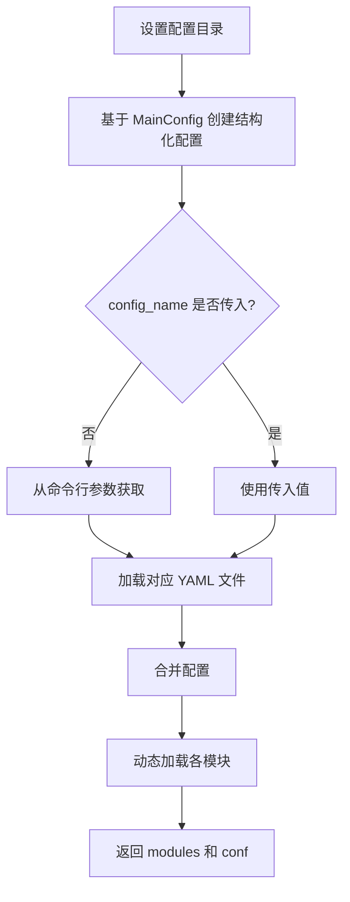

**配置优先级** (从低到高)：
1. `MainConfig` 默认值
2. 命令行参数
3. YAML 配置文件

**返回值**：
- `modules`: 包含所有已加载 Python 模块的字典
- `conf`: 完整的 OmegaConf 配置对象

---

## 2. 模块动态加载机制

### 2.1 `load_module` 函数

位置：`utils/arguments.py`

**功能**：从 OmegaConf 配置中动态加载 Python 模块，并将模块的默认配置与用户配置合并。

**参数**：
| 参数 | 说明 |
|------|------|
| `module_type` | 模块类型字符串（如 `models`、`runners`、`criterions`、`datasets`） |
| `module_config` | OmegaConf 配置对象 |
| `module_name` | (可选) 指定要加载的模块名 |

**核心代码解析**：

```python
module = importlib.import_module(f'{module_type}.{module_name}')
default_module_config = OmegaConf.create(module.Config)
```

- `module`：通过 `importlib.import_module()` 动态导入的 Python 模块对象
- `module.Config`：被导入模块中定义的 `Config` 类（通常是 dataclass），用于声明该模块的默认配置参数

**设计模式**：每个可加载的模块内部都应定义一个 `Config` 类：

```python
# 示例：models/hood.py
from dataclasses import dataclass

@dataclass
class Config:
    hidden_dim: int = 256
    num_layers: int = 4
    dropout: float = 0.1

class HoodModel:
    def __init__(self, config):
        self.hidden_dim = config.hidden_dim
```

**执行流程**：


---

## 3. Model 类架构

位置：`models/postcvpr.py`

### 3.1 与 EncodeProcessDecode 的关系

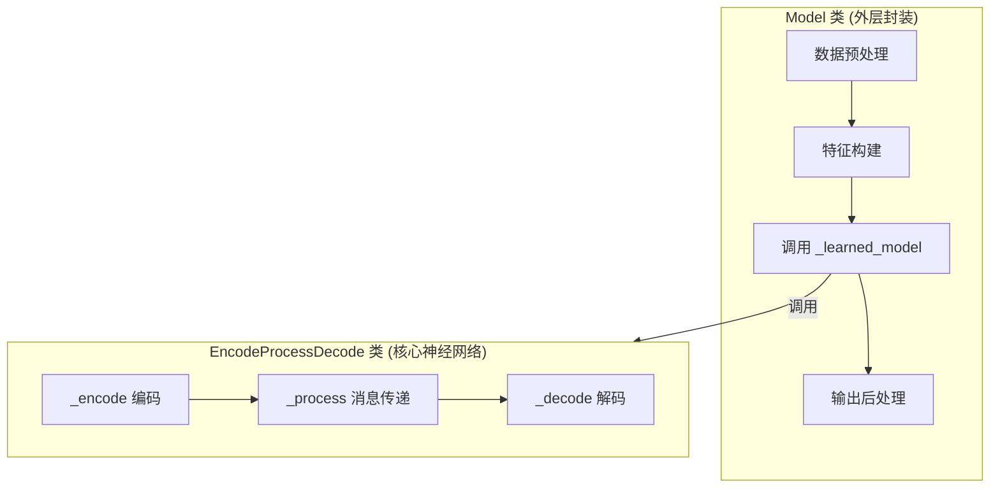

| 角色 | 类 | 职责 |
|------|-----|------|
| **外层包装器** | `Model` | 数据预处理、特征工程、归一化、后处理 |
| **核心学习模型** | `EncodeProcessDecode` | 图神经网络的编码-处理-解码过程 |

### 3.2 成员变量

```python
# 核心模型
self._learned_model           # EncodeProcessDecode 实例，执行实际的图神经网络推理

# 归一化器 (Normalizers)
self._output_normalizer       # 输出加速度的归一化
self._node_normalizer         # 节点特征的归一化
self._mesh_edge_normalizer    # 网格边特征的归一化
self._world_edge_normalizer   # body边（衣物-人体）特征的归一化

# 嵌入层 (Embeddings)
self.nodetype_embedding       # 节点类型嵌入 (普通顶点、固定顶点、人体顶点等)
self.vertexlevel_embedding    # 顶点层级嵌入 (多尺度图的层级)

# 其他
self.normals_f                # 计算顶点法向量的函数
self.collision_radius         # 碰撞检测半径
self.k_world_edges            # 每个衣物顶点最多连接的人体顶点数
```

### 3.3 主要函数

#### 数据准备阶段

| 函数 | 作用 |
|------|------|
| `prepare_inputs()` | **总入口**：协调所有预处理步骤 |
| `replace_pinned_verts()` | 将固定顶点替换为目标位置（如衣领、袖口） |
| `add_positional_edges()` | 动态构建衣物-人体之间的碰撞边 |

#### 特征构建阶段

| 函数 | 作用 |
|------|------|
| `make_nodefeatures()` | 构建所有节点的特征向量 |
| `add_vertex_type_embedding()` | 添加节点类型的嵌入 |
| `add_vertex_level_embedding()` | 添加多尺度层级的嵌入 |
| `add_node_features()` | 组合速度、法向量、材质参数等为节点特征 |
| `create_mesh_edge_set()` | 构建网格边/粗糙边的特征 |
| `create_world_edge_set()` | 构建衣物-人体边的特征 |
| `normalize_node_features()` | 归一化节点特征 |

#### 输出处理阶段

| 函数 | 作用 |
|------|------|
| `get_position()` | 将网络输出的归一化加速度转换为实际位置 |

### 3.4 Forward 流程

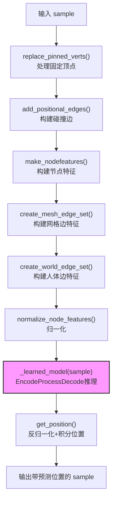

### 3.5 特征向量组成

**节点特征** (24维)：
```
velocity(3) + nodetype_emb(9) + vertexlevel_emb(4) + normals(3) + 
timestep(1) + v_mass(1) + bending_coeff(1) + lame_mu(1) + lame_lambda(1)
```

**网格边特征** (12维)：
```
relative_pos(3) + relative_pos_norm(1) + relative_rest_pos(3) + 
relative_rest_pos_norm(1) + timestep(1) + [材质参数](3)
```

**人体边特征** (9维)：
```
relative_pos(3) + relative_pos_norm(1) + relative_next_pos(3) + 
relative_next_pos_norm(1) + timestep(1)
```

---

## 4. EncodeProcessDecode 核心网络

位置：`models/core/postcvpr.py`

### 4.1 架构概览

`EncodeProcessDecode` 是一个标准的图神经网络架构，包含三个阶段：


### 4.2 三阶段说明

| 阶段 | 函数 | 作用 |
|------|------|------|
| **Encode** | `_encode()` | 将原始特征嵌入到高维隐空间 |
| **Process** | `_process()` | 执行多轮消息传递，聚合邻居信息 |
| **Decode** | `_decode()` | 将隐空间特征映射回物理量（加速度） |

---

## 5. Runner 训练管理器

位置：`runners/postcvpr.py`

### 5.1 概述

`Runner` 类是训练和推理的**核心调度器**，负责协调模型、损失函数、数据采样和优化过程。它继承自 `nn.Module`，是整个训练流程的入口。

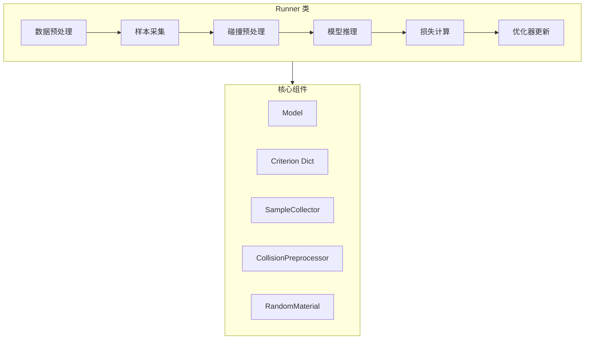

### 5.2 配置类

Runner 模块包含三个配置 dataclass：

#### MaterialConfig - 材质参数配置

```python
@dataclass
class MaterialConfig:
    density_min/max: float          # 密度范围（用于计算节点质量）
    lame_mu_min/max: float          # 剪切模量范围
    lame_lambda_min/max: float      # 拉梅第一参数范围
    bending_coeff_min/max: float    # 弯曲系数范围
    bending_multiplier: float       # 弯曲系数乘数
    
    # 验证时的覆盖参数
    density_override: Optional[float]
    lame_mu_override: Optional[float]
    lame_lambda_override: Optional[float]
    bending_coeff_override: Optional[float]
```

#### OptimConfig - 优化器配置

```python
@dataclass
class OptimConfig:
    lr: float = 1e-4              # 初始学习率
    decay_rate: float = 1e-1      # 衰减乘数
    decay_min: float = 0          # 最小衰减值
    decay_steps: int = 5_000_000  # 衰减步数
    step_start: int = 0           # 起始步数（用于恢复训练）
```

#### Config - 主配置

```python
@dataclass
class Config:
    optimizer: OptimConfig        # 优化器配置
    material: MaterialConfig      # 材质配置
    warmup_steps: int = 100       # 归一化统计预热步数
    increase_roll_every: int = 5000  # 每隔多少步增加预测步数
    roll_max: int = 5             # 最大预测步数
    push_eps: float = 2e-3        # 碰撞求解阈值
    grad_clip: float = 1.         # 梯度裁剪阈值
    initial_ts: float = 1/3       # 初始时间步长
    regular_ts: float = 1/30      # 常规时间步长
```

### 5.3 成员变量

```python
class Runner(nn.Module):
    def __init__(self, model, criterion_dict, mcfg):
        # 核心组件
        self.model               # Model 实例，执行图神经网络推理
        self.criterion_dict      # 损失函数字典 {name: criterion_module}
        self.mcfg                # 配置对象
        
        # 辅助工具
        self.cloth_obj           # ClothMatAug 实例，处理布料材质增强
        self.normals_f           # FaceNormals 实例，计算面法向量
        self.sample_collector    # SampleCollector 实例，样本采集器
        self.collision_solver    # CollisionPreprocessor 实例，碰撞预处理
        self.random_material     # RandomMaterial 实例，随机材质采样
```

### 5.4 主要函数

#### 训练相关

| 函数 | 作用 |
|------|------|
| `forward()` | **训练入口**：执行多步自回归训练 |
| `collect_sample()` | 训练时采集单步样本 |
| `criterion_pass()` | 计算所有损失项 |
| `optimizer_step()` | 执行梯度裁剪和优化器更新 |
| `add_cloth_obj()` | 添加布料对象和材质属性 |
| `set_random_material()` | 随机采样材质参数 |

#### 验证/推理相关

| 函数 | 作用 |
|------|------|
| `valid_rollout()` | **推理入口**：生成完整序列轨迹 |
| `_rollout()` | 内部循环执行多步推理 |
| `collect_sample_wholeseq()` | 验证时从完整序列采集样本 |

### 5.5 训练流程 (`forward`)

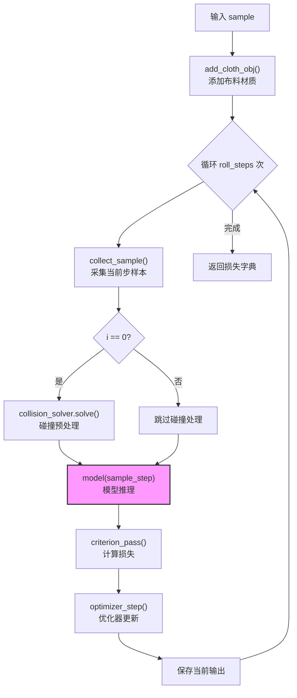

### 5.6 推理流程 (`valid_rollout`)

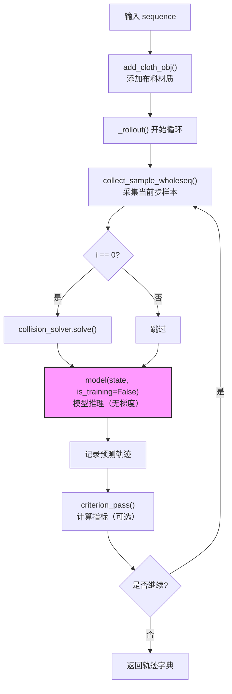

### 5.7 时间步策略

训练中使用**两种时间步长**来帮助模型学习：

| 时间步 | 值 | 使用场景 |
|--------|-----|----------|
| `initial_ts` | 1/3 | 第一帧，较大步长帮助快速达到静态平衡 |
| `regular_ts` | 1/30 | 后续帧，标准仿真步长 |

### 5.8 渐进式训练策略

Runner 实现了**渐进式自回归训练**：

```python
# 计算当前步数应该预测的步数
roll_steps = 1 + (global_step // increase_roll_every)
roll_steps = min(roll_steps, roll_max)
```

- 训练初期只预测 1 步
- 每隔 `increase_roll_every` 步（默认5000）增加 1 步
- 最多预测 `roll_max` 步（默认5步）

这种策略让模型先学会单步预测，再逐步学习长序列预测，提高训练稳定性。

### 5.9 辅助函数

#### `run_epoch()` - 训练一个 epoch

```python
def run_epoch(training_module, aux_modules, dataloader, n_epoch, cfg, global_step=None):
    """
    执行一个完整的训练 epoch
    
    关键步骤：
    1. 遍历 dataloader
    2. 计算当前 roll_steps
    3. 调用 training_module.forward()
    4. 定期保存 checkpoint
    """
```

#### `create_optimizer()` - 创建优化器

```python
def create_optimizer(training_module, mcfg):
    """
    创建 Adam 优化器和 LambdaLR 学习率调度器
    
    学习率衰减公式:
    decay = decay_rate^(step // decay_steps) + 1e-2
    decay = max(decay, decay_min)
    """
```

### 5.10 组件关系图

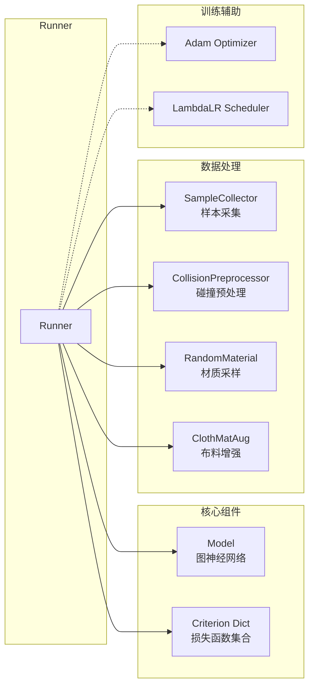

---

## 6. 数据加载模块

本节以 `postcvpr` 类型为例，分析 `Loader`、`Dataset` 和 `DataLoaderModule` 三个类的结构和它们之间的关系。

### 6.1 整体架构

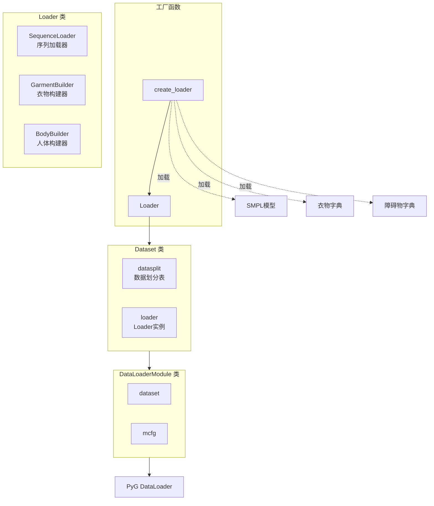

### 6.2 数据流向


---

### 6.3 Config 配置类

位置：`datasets/postcvpr.py`

```python
@dataclass
class Config:
    # 必需参数
    data_root: str = MISSING          # 数据根目录（相对于 $HOOD_DATA/）
    smpl_model: str = MISSING         # SMPL 模型路径
    garment_dict_file: str = MISSING  # 衣物字典文件路径
    
    # 可选参数
    split_path: Optional[str] = None         # CSV 数据划分文件路径
    obstacle_dict_file: Optional[str] = None # 障碍物辅助数据文件
    
    # 训练参数
    noise_scale: float = 3e-3         # 衣物顶点噪声尺度
    lookup_steps: int = 5             # 未来帧查看步数
    pinned_verts: bool = False        # 是否使用固定顶点
    wholeseq: bool = False            # 是否加载完整序列（验证时为True）
    
    # SMPL 体型参数
    random_betas: bool = False        # 是否随机采样体型参数
    betas_scale: float = 0.1          # 体型参数缩放范围
    zero_betas: bool = False          # 是否将体型参数置零
    use_betas_for_restpos: bool = False # 是否用体型参数计算静止姿态
    
    # 多尺度图参数
    n_coarse_levels: int = 1          # 粗糙层级数量
    
    # 几何参数
    restpos_scale_min: float = 1.     # 静止姿态最小缩放
    restpos_scale_max: float = 1.     # 静止姿态最大缩放
    separate_arms: bool = False       # 是否分离手臂（避免自穿透）
    button_edges: bool = False        # 是否加载纽扣边
    
    # 单序列模式（用于推理）
    single_sequence_file: Optional[str] = None
    single_sequence_garment: Optional[str] = None
    betas_file: Optional[str] = None  # 体型参数表文件
```

---

### 6.4 Loader 类

位置：`datasets/postcvpr.py`

**功能**：构建包含单个样本所有数据的 `HeteroData` 对象。

#### 6.4.1 成员变量

```python
class Loader:
    def __init__(self, mcfg, garments_dict, smpl_model, 
                 garment_smpl_model_dict, obstacle_dict, betas_table=None):
        self.sequence_loader  # SequenceLoader: 加载 SMPL 参数序列
        self.garment_builder  # GarmentBuilder: 构建衣物网格数据
        self.body_builder     # BodyBuilder: 构建人体网格数据
        self.data_path        # str: 数据根目录
```

#### 6.4.2 核心方法

```python
def load_sample(self, fname: str, idx: int, garment_name: str, betas_id: int) -> HeteroData:
    """
    构建单个样本的 HeteroData 对象
    
    参数:
        fname: 序列文件名（相对于 data_path）
        idx: 帧索引（wholeseq=True 时不使用）
        garment_name: 衣物名称
        betas_id: 体型参数索引（验证时使用）
    
    返回:
        HeteroData 对象，包含衣物和人体的所有数据
    """
```

#### 6.4.3 内部组件

##### SequenceLoader - 序列加载器

负责从磁盘加载 SMPL 参数序列并进行预处理：

| 方法 | 功能 |
|------|------|
| `load_sequence()` | 加载 .pkl 序列文件 |
| `process_sequence()` | 处理序列（分离手臂、随机体型、置零手部姿态等） |

**处理流程**：
1. 分离手臂姿态（`separate_arms`）- 消除手-身体穿透
2. 随机采样体型参数（`random_betas`）
3. 置零手部姿态（消除不真实的手部动作）
4. 可选：置零所有体型参数

##### GarmentBuilder - 衣物构建器

负责构建衣物网格的所有数据：

| 方法 | 功能 |
|------|------|
| `build()` | **总入口**：构建所有衣物数据 |
| `make_cloth_verts()` | 使用 GarmentSMPL 生成衣物顶点 |
| `add_vertex_type()` | 添加顶点类型（普通/固定） |
| `add_restpos()` | 添加静止姿态几何 |
| `add_faces_and_edges()` | 添加面片和网格边 |
| `add_coarse()` | 添加多尺度粗糙边 |
| `add_button_edges()` | 添加纽扣边（可选） |
| `make_vertex_level()` | 计算顶点层级标签 |

**构建的数据字段**：

| 字段 | 类型 | 说明 |
|------|------|------|
| `sample['cloth'].pos` | `[Vx3]` 或 `[VxNx3]` | 当前帧顶点位置 |
| `sample['cloth'].prev_pos` | `[Vx3]` 或 `[VxNx3]` | 前一帧顶点位置 |
| `sample['cloth'].target_pos` | `[Vx3]` 或 `[VxNx3]` | 下一帧顶点位置（GT） |
| `sample['cloth'].lookup` | `[VxLx3]` | 未来 L 帧位置（训练用） |
| `sample['cloth'].rest_pos` | `[Vx3]` | 静止姿态位置 |
| `sample['cloth'].vertex_type` | `[Vx1]` | 顶点类型 |
| `sample['cloth'].vertex_level` | `[Vx1]` | 多尺度层级 |
| `sample['cloth'].faces_batch` | `[3xF]` | 面片索引 |
| `sample['cloth', 'mesh_edge', 'cloth'].edge_index` | `[2xE]` | 网格边 |
| `sample['cloth', 'coarse_edge{i}', 'cloth'].edge_index` | `[2xE_i]` | 粗糙边 |

##### BodyBuilder - 人体构建器

负责构建人体（障碍物）网格的所有数据：

| 方法 | 功能 |
|------|------|
| `build()` | **总入口**：构建所有人体数据 |
| `make_smpl_vertices()` | 使用 SMPL 模型生成人体顶点 |
| `add_vertex_type()` | 添加顶点类型（普通/手部） |
| `add_faces()` | 添加人体面片 |
| `add_vertex_level()` | 添加层级标签（始终为0） |

**构建的数据字段**：

| 字段 | 类型 | 说明 |
|------|------|------|
| `sample['obstacle'].pos` | `[Vx3]` 或 `[VxNx3]` | 当前帧顶点位置 |
| `sample['obstacle'].prev_pos` | `[Vx3]` 或 `[VxNx3]` | 前一帧顶点位置 |
| `sample['obstacle'].target_pos` | `[Vx3]` 或 `[VxNx3]` | 下一帧顶点位置 |
| `sample['obstacle'].lookup` | `[VxLx3]` | 未来 L 帧位置 |
| `sample['obstacle'].faces_batch` | `[3xF]` | 面片索引 |
| `sample['obstacle'].vertex_type` | `[Vx1]` | 顶点类型（1=普通, 2=手部） |
| `sample['obstacle'].vertex_level` | `[Vx1]` | 层级（始终为0） |

#### 6.4.4 工厂函数 create_loader

```python
def create_loader(mcfg: Config) -> Loader:
    """
    创建 Loader 实例的工厂函数
    
    执行步骤:
    1. 加载衣物字典 (garments_dict)
    2. 加载 SMPL 模型
    3. 创建 GarmentSMPL 模型字典
    4. 创建障碍物字典
    5. 可选：加载体型参数表
    6. 实例化 Loader
    """
```

---

### 6.5 Dataset 类

位置：`datasets/postcvpr.py`

**功能**：PyTorch 风格的数据集类，管理数据划分并提供样本索引访问。

#### 6.5.1 成员变量

```python
class Dataset:
    def __init__(self, loader: Loader, datasplit: pd.DataFrame, wholeseq=False):
        self.loader     # Loader: 样本加载器
        self.datasplit  # pd.DataFrame: 数据划分表（id, length, garment 列）
        self.wholeseq   # bool: 是否加载完整序列
        self._len       # int: 数据集总长度
        self.all_lens   # List[int]: 每个序列的有效帧数（仅 wholeseq=False 时）
```

#### 6.5.2 核心方法

| 方法 | 功能 |
|------|------|
| `__len__()` | 返回数据集长度 |
| `__getitem__(item)` | 根据索引加载样本 |
| `_find_idx(index)` | 将全局索引转换为（序列名, 帧索引, 衣物名） |

#### 6.5.3 两种工作模式

**训练模式** (`wholeseq=False`)：
- 每个样本是**单帧**数据
- 全局索引映射到特定序列的特定帧
- `_len = sum(all_lens)`，所有序列的有效帧数之和
- 每帧有效长度 = 序列长度 - 7（预留 lookup 帧）

**验证模式** (`wholeseq=True`)：
- 每个样本是**完整序列**
- 全局索引直接对应序列
- `_len = datasplit.shape[0]`，序列数量


---

### 6.6 DataLoaderModule 类

位置：`utils/dataloader.py`

**功能**：封装 PyTorch Geometric 的 DataLoader 创建逻辑。

```python
class DataloaderModule:
    def __init__(self, dataset, mcfg):
        self.dataset = dataset  # Dataset 实例
        self.mcfg = mcfg        # 配置对象（需包含 batch_size, num_workers）

    def create_dataloader(self, is_eval=False):
        """
        创建 PyG DataLoader
        
        参数:
            is_eval: 是否为评估模式
                - True: 不打乱数据
                - False: 打乱数据（训练）
        
        返回:
            torch_geometric.loader.DataLoader 实例
        """
        dl_class = pyg.loader.DataLoader
        dataloader = dl_class(
            self.dataset, 
            batch_size=mcfg.batch_size, 
            num_workers=mcfg.num_workers,
            shuffle=(not is_eval)
        )
        return dataloader
```

---

### 6.7 类间关系图

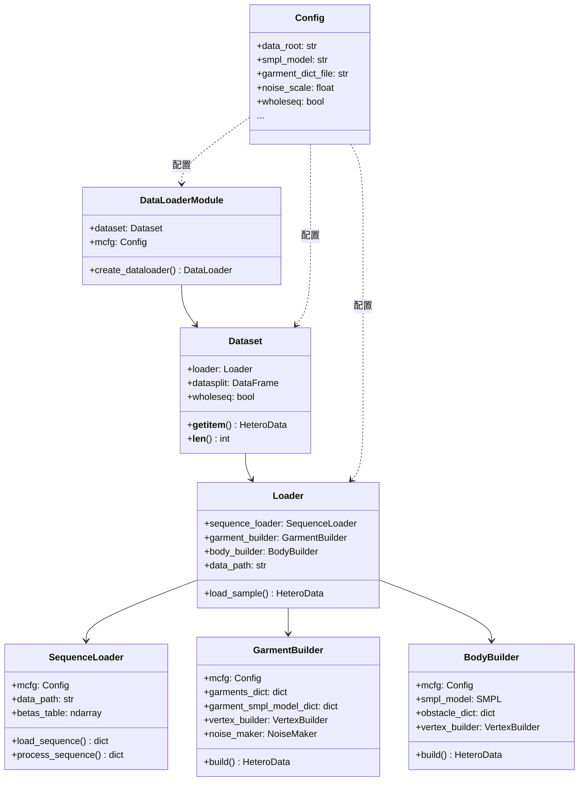

---

### 6.8 完整数据加载流程

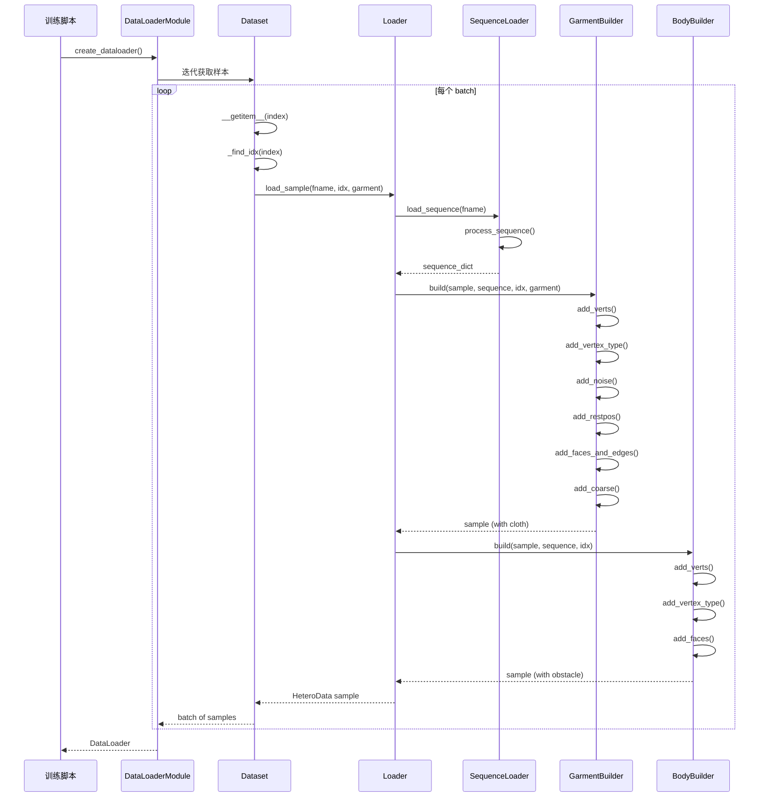

---

## 7. postcvpr 与 from_any_pose 模块对比分析

本节对比分析 `postcvpr` 和 `from_any_pose` 两种类型在 **Config**、**Dataset**、**Runner** 三个模块中的相同点和差异点。

### 7.1 应用场景概述

| 类型 | 应用场景 | 数据来源 |
|------|----------|----------|
| **postcvpr** | 大规模训练 | VTO 数据集，多序列、多衣物 |
| **from_any_pose** | 推理/演示 | 单一姿态序列 + 单一衣物模板 |

---

### 7.2 Config 配置对比

#### 7.2.1 Dataset Config 对比

| 配置项 | postcvpr | from_any_pose | 说明 |
|--------|----------|---------------|------|
| **数据源** | `data_root` + `split_path` (CSV) | `pose_sequence_path` | postcvpr 使用数据集，from_any_pose 使用单文件 |
| **衣物定义** | `garment_dict_file` (多衣物字典) | `garment_template_path` (单衣物模板) | postcvpr 支持多衣物，from_any_pose 仅单衣物 |
| **SMPL 模型** | 必需 (`MISSING`) | 可选 (`None`) | from_any_pose 可直接使用 mesh 序列 |
| **姿态类型** | 仅 SMPL | `pose_sequence_type`: "smpl" 或 "mesh" | from_any_pose 更灵活 |
| **噪声** | `noise_scale: 3e-3` | 无 | 仅训练时需要噪声增强 |
| **lookup_steps** | `5` | 无 | 仅训练时需要未来帧 |
| **pinned_verts** | 支持 | 不支持 | 训练时可使用固定顶点 |
| **wholeseq** | 可配置 | 始终 True | from_any_pose 只用于整序列推理 |
| **random_betas** | 支持 | 不支持 | 训练时的数据增强 |
| **restpos 缩放** | `restpos_scale_min/max` | 无 | 训练时的几何增强 |
| **button_edges** | 支持 | 不支持 | 特殊衣物功能 |

**postcvpr Config（训练专用参数）**：
```python
@dataclass
class Config:
    data_root: str = MISSING
    smpl_model: str = MISSING
    garment_dict_file: str = MISSING
    split_path: Optional[str] = None
    
    # 训练专用
    noise_scale: float = 3e-3
    lookup_steps: int = 5
    pinned_verts: bool = False
    wholeseq: bool = False
    random_betas: bool = False
    betas_scale: float = 0.1
    restpos_scale_min: float = 1.
    restpos_scale_max: float = 1.
    button_edges: bool = False
    
    # 单序列推理模式
    single_sequence_file: Optional[str] = None
    single_sequence_garment: Optional[str] = None
```

**from_any_pose Config（推理专用参数）**：
```python
@dataclass
class Config:
    pose_sequence_path: str = MISSING
    garment_template_path: str = MISSING
    pose_sequence_type: str = "smpl"  # "smpl" | "mesh"
    smpl_model: Optional[str] = None
    n_coarse_levels: int = 4
    separate_arms: bool = False
```

#### 7.2.2 Runner Config 对比

两种类型的 Runner Config **完全相同**：

```python
@dataclass
class MaterialConfig:
    density_min/max: float
    lame_mu_min/max: float
    lame_lambda_min/max: float
    bending_coeff_min/max: float
    # ... override 参数

@dataclass
class OptimConfig:
    lr: float = 1e-4
    decay_rate: float = 1e-1
    decay_steps: int = 5_000_000

@dataclass
class Config:
    optimizer: OptimConfig
    material: MaterialConfig
    warmup_steps: int = 100
    increase_roll_every: int = 5000
    roll_max: int = 5
    initial_ts: float = 1/3
    regular_ts: float = 1/30
```

#### 7.2.3 YAML 配置文件对比

**postcvpr.yaml**：
```yaml
dataloader:
  dataset:
    postcvpr:
      data_root: 'vto_dataset/smpl_parameters'
      split_path: 'datasplits/train.csv'
      garment_dict_file: 'garments_dict.pkl'
      lookup_steps: 5
      pinned_verts: True
      random_betas: True
      betas_scale: 3.
      n_coarse_levels: 3
```

**from_any_pose.yaml**：
```yaml
dataloader:
  dataset:
    from_any_pose:
      pose_sequence_type: "mesh"
      pose_sequence_path: '../Tests/data/01_01_mesh_female.pkl'
      garment_template_path: '../Tests/data/tshirt.pkl'
      n_coarse_levels: 3
```

---

### 7.3 Dataset 模块对比

#### 7.3.1 类结构对比

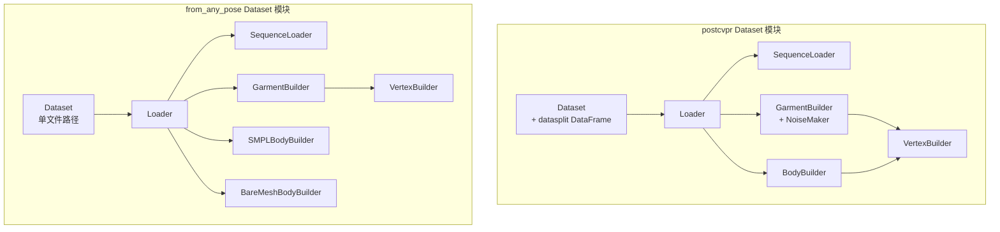

#### 7.3.2 核心类对比

| 组件 | postcvpr | from_any_pose | 差异说明 |
|------|----------|---------------|----------|
| **Loader** | 支持多衣物、多序列 | 单衣物、单序列 | from_any_pose 简化版 |
| **SequenceLoader** | 支持 betas_table、多种预处理 | 仅基础预处理 | postcvpr 更完整 |
| **GarmentBuilder** | 使用 GarmentSMPL 驱动 | 直接使用模板顶点 | 完全不同的顶点生成方式 |
| **BodyBuilder** | 仅 SMPL | SMPL 或 BareMesh | from_any_pose 支持两种 |
| **NoiseMaker** | 有 | 无 | 仅训练需要 |
| **Dataset** | DataFrame 索引 | 固定单样本 | 数据管理方式不同 |

#### 7.3.3 GarmentBuilder 详细对比

**postcvpr GarmentBuilder**：
- 使用 `GarmentSMPL` 模型根据 SMPL 姿态**动态生成**衣物顶点
- 支持多衣物（通过 `garment_name` 选择）
- 支持噪声增强、restpos 缩放、button_edges
- 支持两种模式：单帧（训练）/ 整序列（验证）

```python
def make_cloth_verts(self, body_pose, global_orient, transl, betas, garment_name):
    garment_smpl_model = self.garment_smpl_model_dict[garment_name]
    vertices = garment_smpl_model.make_vertices(betas=betas, full_pose=full_pose, transl=transl)
    return vertices
```

**from_any_pose GarmentBuilder**：
- 直接使用**静态模板**的顶点
- 仅支持单衣物
- 无噪声增强
- 始终整序列模式

```python
def add_verts(self, sample, garment_dict):
    pos = garment_dict['vertices']  # 直接使用静态模板
    pos = torch.FloatTensor(pos)[None,].permute(1, 0, 2)
    sample['cloth'].pos = pos
    return sample
```

#### 7.3.4 BodyBuilder 详细对比

**postcvpr**：仅支持 `BodyBuilder`（SMPL 驱动）

**from_any_pose**：支持两种 BodyBuilder
- `SMPLBodyBuilder`：当 `pose_sequence_type == "smpl"` 时使用
- `BareMeshBodyBuilder`：当 `pose_sequence_type == "mesh"` 时使用

```python
# from_any_pose Loader 初始化
if mcfg.pose_sequence_type == 'smpl':
    self.body_builder = SMPLBodyBuilder(mcfg, smpl_model, obstacle_dict)
elif mcfg.pose_sequence_type == 'mesh':
    self.body_builder = BareMeshBodyBuilder(mcfg, obstacle_dict)
```

#### 7.3.5 Dataset 类对比

| 特性 | postcvpr | from_any_pose |
|------|----------|---------------|
| **数据源** | `pd.DataFrame` (CSV) | 单文件路径 |
| **`__len__`** | 动态计算（帧数或序列数） | 固定为 1 |
| **`__getitem__`** | 索引映射到序列+帧 | 始终返回同一样本 |
| **`_find_idx`** | 有（全局索引→局部索引） | 无 |
| **wholeseq 模式** | 训练 False / 验证 True | 始终 True |

**postcvpr Dataset**：
```python
class Dataset:
    def __init__(self, loader, datasplit, wholeseq=False):
        self.datasplit = datasplit  # DataFrame
        if self.wholeseq:
            self._len = self.datasplit.shape[0]
        else:
            self.all_lens = [int(x) - 7 for x in datasplit.length.tolist()]
            self._len = sum(self.all_lens)

    def __getitem__(self, item):
        if self.wholeseq:
            fname = self.datasplit.id[item]
            garment_name = self.datasplit.garment[item]
        else:
            fname, idx, garment_name = self._find_idx(item)
        return self.loader.load_sample(fname, idx, garment_name, betas_id)
```

**from_any_pose Dataset**：
```python
class Dataset:
    def __init__(self, loader, pose_sequence_path):
        self.pose_sequence_path = pose_sequence_path
        self._len = 1  # 固定为 1

    def __getitem__(self, item):
        sample = self.loader.load_sample(self.pose_sequence_path)
        return sample
```

---

### 7.4 Runner 模块对比

#### 7.4.1 相同点

两种 Runner **几乎完全相同**，共享以下内容：

- **Config 类**：`MaterialConfig`、`OptimConfig`、`Config` 完全一致
- **成员变量**：`model`、`criterion_dict`、`sample_collector`、`collision_solver`、`random_material` 等
- **核心方法**：`forward()`、`valid_rollout()`、`_rollout()`、`criterion_pass()`、`optimizer_step()`
- **辅助函数**：`create_optimizer()`、`run_epoch()`

#### 7.4.2 差异点

| 方法 | postcvpr | from_any_pose | 差异说明 |
|------|----------|---------------|----------|
| `SampleCollector` 初始化 | `SampleCollector(mcfg)` | `SampleCollector(mcfg, no_target=True)` | from_any_pose 无目标位置 |
| `collect_sample_wholeseq` 第一帧 | `target2pos()` + `pos2prev()` | 仅 `pos2prev()` | postcvpr 额外设置初始位置 |
| `collect_sample` 第一帧 | `pos2target()` | `pos2target()` | 相同 |

**关键差异代码对比**：

```python
# postcvpr collect_sample_wholeseq
if index == 0:
    sample_step = self.sample_collector.target2pos(sample_step)  # 额外步骤
    sample_step = self.sample_collector.pos2prev(sample_step)
    ts = self.mcfg.initial_ts

# from_any_pose collect_sample_wholeseq
if index == 0:
    # sample_step = self.sample_collector.target2pos(sample_step)  # 注释掉了
    sample_step = self.sample_collector.pos2prev(sample_step)
    ts = self.mcfg.initial_ts
```

**原因**：`from_any_pose` 的衣物初始位置是静态模板，不需要从 `target_pos` 复制。

#### 7.4.3 run_epoch 差异

```python
# postcvpr run_epoch
if cfg.experiment.max_iter is not None:
    num_iter = min(len(dataloader), cfg.experiment.max_iter)
else:
    num_iter = len(dataloader)
prbar = tqdm(dataloader, desc=cfg.config, total=num_iter)

# from_any_pose run_epoch
prbar = tqdm(dataloader, desc=cfg.config)
```

postcvpr 版本增加了 `max_iter` 限制的进度条总数计算。

---

### 7.5 整体架构对比图

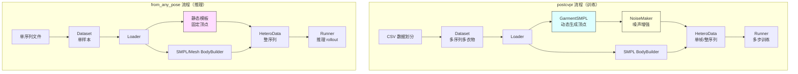

---

### 7.6 对比总结表

| 维度 | postcvpr | from_any_pose |
|------|----------|---------------|
| **设计目标** | 大规模训练 | 推理/演示 |
| **数据规模** | 多序列、多衣物 | 单序列、单衣物 |
| **衣物顶点** | GarmentSMPL 动态生成 | 静态模板 |
| **人体输入** | 仅 SMPL 参数 | SMPL 或 Mesh |
| **数据增强** | 噪声、随机体型、restpos缩放 | 无 |
| **训练/验证模式** | 支持两种 | 仅验证模式 |
| **Dataset 长度** | 动态（帧数累加） | 固定为 1 |
| **Runner** | 完整版 | 简化版（无 target2pos） |
| **Config 复杂度** | 高（20+ 参数） | 低（7 参数） |

---

### 7.7 使用建议

- **训练新模型**：使用 `postcvpr` 类型，配合完整的 VTO 数据集
- **推理/演示**：使用 `from_any_pose` 类型，只需准备姿态序列和衣物模板
- **迁移学习**：可用 `postcvpr` 预训练，然后用 `from_any_pose` 微调或直接推理

---

## 总结

**简单来说**：
- `Model` = **数据管道** + `EncodeProcessDecode`
- `EncodeProcessDecode` = **纯神经网络**（Encode → Message Passing → Decode）
- `Model` 负责把"物理世界的布料数据"转换成"图神经网络能理解的特征"，再把"网络输出"转换回"物理世界的位置预测"
